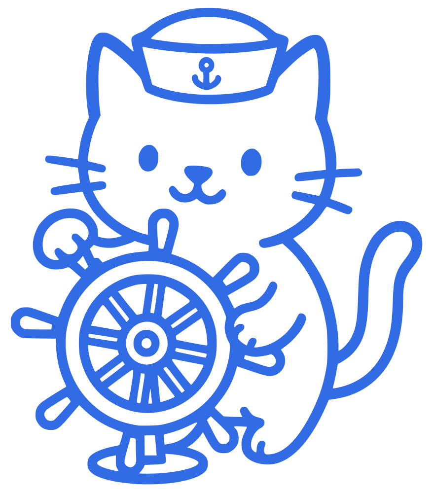
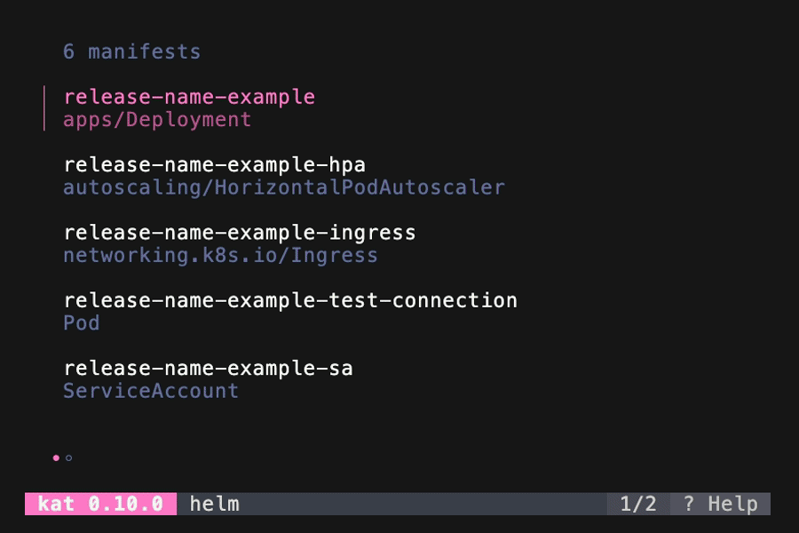

<p align="center">
  <a href="#"></a>
  <h1 align="center">kat</h1>
</p>

<p align="center">
  <a href="https://pkg.go.dev/github.com/macropower/kat"></a>
  <a href="https://goreportcard.com/report/github.com/macropower/kat"></a>
  <a href="https://codecov.io/gh/macropower/kat"></a>
  <a href="#-installation"></a>
  <a href="#-installation"></a>
  <a href="https://github.com/macropower/kat/blob/main/LICENSE"></a>
</p>

`kat` automatically invokes manifest generators like `helm` or `kustomize`, and provides a persistent, navigable view of rendered resources, with support for live reloading, integrated validation, and more.

It is made of two main components, which can be used together or independently:

1. A **rule-based engine** for automatically rendering and validating manifests
2. A **terminal UI** for browsing and debugging rendered Kubernetes manifests

Together, these deliver a seamless development experience that maintains context and focus while iterating on Helm charts, Kustomize overlays, and other manifest generators.

<p align="center">
  
</p>

<p align="center">
  ❤️ Made with <a href="https://github.com/charmbracelet/bubbletea">bubble tea</a>, <a href="https://github.com/alecthomas/chroma/">chroma</a>, and <a href="#-dependencies">other amazing libraries</a>.
</p>

## ✨ Features

**🔍️ Manifest browsing**

- Navigate hundreds of resources with fuzzy search and filtering
- View individual resources in your terminal with syntax highlighting

**⚡️ Live reload**

- Monitor source files with `--watch` for automatic re-rendering
- Maintain your current context between reloads so you don't lose your place
- Highlight changes with diff visualization between renders

**🐛 Error handling**

- Surface rendering and validation errors as overlays
- Works with reload; fix source files and watch errors disappear instantly

**🧪 Tool integration**

- Define profiles for any manifest generator (Helm, Kustomize, CUE, KCL, Jsonnet, etc.)
- Run tools like `kubeconform` or `kyverno` automatically on rendered manifests
- Chain multiple tools together with pre and post-render hooks

**🎯 Project detection**

- Select your defined profiles automatically using CEL expressions
- Match projects based on file contents, structure, or naming patterns

**🔌 Plugin system**

- Add custom keybind-triggered commands for your specific workflows
- Execute dry-runs, deployments, or any custom tooling without leaving kat

**🤖 MCP server** (Experimental)

- Limit access to irrelevant context, improving performance and reducing cost
- Force your AI to always follow the same rendering and validation pipeline
- Enable iterative testing _without_ handing over cluster or command-line access

**🎨 Fully customizable**

- Choose from any available Chroma themes, or define your own
- Remap any keybinding to match your preferences

## 📦 Installation

<details>
<summary><strong>Homebrew</strong></summary>

You can install `kat` using my [tap](https://github.com/MacroPower/homebrew-tap).

With `brew`:

```sh
brew install macropower/tap/kat --cask
```

With your `Brewfile`:

```sh
tap "macropower/tap"
cask "kat"
```

</details>

<details>
<summary><strong>Go</strong></summary>

```sh
go install github.com/macropower/kat/cmd/kat@latest
```

</details>

<details>
<summary><strong>Docker</strong></summary>

Docker images are published to [ghcr.io/macropower](https://github.com/MacroPower/kat/pkgs/container/kat).

All images are configured with `WORKDIR=/data`, so you can mount your current directory there to run `kat` against your local files.

Run the latest alpine image:

```sh
docker run -it -v .:/data -e TERM=$TERM ghcr.io/macropower/kat:latest-alpine
```

The default config is located at `/config/kat/config.yaml`, and you can override it by mounting your own configuration file at that path.

There is also a scratch image that contains only the `kat` binary, which is useful when you want to build your own image (which I generally recommend doing):

```dockerfile
FROM alpine:latest
COPY --from=ghcr.io/macropower/kat:latest /kat /usr/local/bin/kat
# Add whatever customization you need here.
ENTRYPOINT ["/usr/local/bin/kat"]
```

</details>

<details>
<summary><strong>Nix (NUR)</strong></summary>

You can install `kat` using my [NUR](https://github.com/MacroPower/nur-packages).

With `nix-env`:

```sh
nix-env -iA kat -f https://github.com/macropower/nur-packages/archive/main.tar.gz
```

With `nix-shell`:

```sh
nix-shell -A kat https://github.com/macropower/nur-packages/archive/main.tar.gz
```

With your `flake.nix`:

```nix
{
  inputs = {
    macropower.url = "github:macropower/nur-packages";
  };
  # Reference the package as `inputs.macropower.packages.<system>.kat`
}
```

With [`devbox`](https://www.jetify.com/docs/devbox/):

```sh
devbox add github:macropower/nur-packages#kat
```

</details>

<details>
<summary><strong>GitHub CLI</strong></summary>

```sh
gh release download -R macropower/kat -p "kat_$(uname -s)_$(uname -m).tar.gz" -O - | tar -xz
```

And then move `kat` to a directory in your `PATH`.

</details>

<details>
<summary><strong>Curl</strong></summary>

```sh
curl -s https://api.github.com/repos/macropower/kat/releases/latest | \
  jq -r ".assets[] |
    select(.name | test(\"kat_$(uname -s)_$(uname -m).tar.gz\")) |
    .browser_download_url" | \
  xargs curl -L | tar -xz
```

And then move `kat` to a directory in your `PATH`.

</details>

Or, download a binary from [releases](https://github.com/macropower/kat/releases).

> Note: The default `kat` configuration contains references to `helm`, `kustomize`, and `yq`. If you want to use `kat` with these tools, you will need to install them separately.

## 🔏 Verification

You can verify the authenticity and integrity of `kat` releases.

See [verification](docs/verification.md) for more details.

## 🚀 Usage

Show help:

```sh
kat --help
```

Render a project in the current directory:

```sh
kat
```

Render a project and enable watch (live reloading):

```sh
kat -w
```

Render a project in a specific directory:

```sh
kat ./example/helm
```

Render a project in a specific directory using the `ks` profile:

```sh
kat ./example/kustomize ks
```

Render a project with custom profile arguments:

```sh
kat ./example/helm -- -g -f prod-values.yaml

kat ./example/kustomize ks -- --enable-helm
```

Render a project with command passthrough:

```sh
kat ./example/helm task -- helm:render
```

Read from stdin (disables rendering engine):

```sh
cat ./example/kustomize/resources.yaml | kat -
```

Send output to a file (disables TUI):

```sh
kat ./example/helm > manifest.yaml
```

You can optionally start `kat` with an MCP server by using the `--serve-mcp` flag:

```sh
kat --serve-mcp :50165
```

> See [MCP Server](docs/mcp.md) for more details.

## ⚙️ Configuration

When you first run `kat`, it will attempt to add default configuration files to `$XDG_CONFIG_HOME/kat/` (or `~/.config/kat/`). This configuration allows you to customize the behavior of `kat`, such as the UI style, keybindings, rules for project detection, and profiles for rendering different types of projects.

Note that JSON schemas are also included in the configuration directory, which can be used by your editor's YAML language server.

> Some of the default behavior around loading configuration can be overridden with command line flags or environment variables. See `kat --help` for details.

Over time, the default configuration may change, and the schema is currently still evolving. If you want to reset your configuration to the latest defaults, you can use `kat --write-config`, which will move your existing configuration to a backup file and generate a new default configuration.

> You can find the default configuration file as well as JSON schemas in [pkg/config](pkg/config).

## 🛠️ Rules and Profiles

You can customize how `kat` detects and renders different types of projects using **rules** and **profiles** in the configuration file. This system uses [CEL (Common Expression Language)](https://cel.dev/) expressions to provide flexible file matching and processing.

### 🎯 Rules

**Rules determine which profile should be used.** Each rule contains:

- `match` (required): A CEL expression that returns `true` if the rule should be applied
- `profile` (required): The name of the profile to use when this rule matches

Rules use boolean CEL expressions with access to:

- `files` (list<string>): All file paths in the directory
- `dir` (string): The directory path being processed

```yaml
rules:
  - # Select the Helm profile if any Helm chart files exist
    match: >-
      files.exists(f, pathBase(f) in ["Chart.yaml", "Chart.yml"])
    profile: helm

  - # Select the Kustomize profile if any Kustomization files exist
    match: >-
      files.exists(f, pathBase(f) in ["kustomization.yaml", "kustomization.yml"])
    profile: ks

  - # Fallback: select the YAML profile if any YAML files exist
    match: >-
      files.exists(f, pathExt(f) in [".yaml", ".yml"])
    profile: yaml
```

### 🎭 Profiles

**Profiles define how to render projects.** They can be automatically selected by rules, or manually specified when `kat` is invoked. Each profile contains:

- `command` (required): The command to execute
- `args`: Arguments to pass to the command
- `extraArgs`: Arguments that can be overridden from the CLI
- `env`: List of environment variables for the command
- `envFrom`: List of sources for environment variables
- `source`: Define which files to watch for changes (when watch is enabled)
- `reload`: Define conditions for when events should trigger a reload
- `ui`: UI configuration overrides
- `hooks`: Initialization and rendering hooks
  - `init` hooks are executed once when `kat` is initialized
  - `preRender` hooks are executed before the profile's command is run
  - `postRender` hooks are executed after the profile's command has run, and are provided the rendered output via stdin
- `plugins`: Custom commands that can be executed on-demand with keybinds
  - `description` (required): Human-readable description of what the plugin does
  - `keys` (required): Array of key bindings that trigger the plugin
  - `command` (required): The command to execute
  - `args`: Arguments to pass to the command

```yaml
profiles:
  helm:
    command: helm
    args: [template, .]
    extraArgs: [-g]
    source: >-
      files.filter(f, pathExt(f) in [".yaml", ".yml", ".tpl"])
    reload: >-
      fs.event.has(fs.WRITE, fs.CREATE, fs.REMOVE)
    envFrom:
      - callerRef:
          pattern: "^HELM_.+"
    ui:
      theme: dracula
    hooks:
      init:
        - command: helm
          args: [version, --short]
      preRender:
        - command: helm
          args: [dependency, build]
          envFrom:
            - callerRef:
                pattern: "^HELM_.+"
      postRender:
        # Pass the rendered manifest via stdin to `kubeconform`.
        - command: kubeconform
          args: [-strict, -summary]
    plugins:
      dry-run:
        command: helm
        args: [install, ., -g, --dry-run]
        envFrom:
          - callerRef:
              pattern: "^HELM_.+"
        description: invoke helm dry-run
        keys:
          - code: ctrl+r
            alias: ⌃r

  ks:
    command: kustomize
    args: [build, .]
    source: >-
      files.filter(f, pathExt(f) in [".yaml", ".yml"])
    reload: >-
      fs.event.has(fs.WRITE, fs.CREATE, fs.REMOVE)
    env:
      - name: KUSTOMIZE_ENABLE_ALPHA_COMMANDS
        value: "true"
    ui:
      compact: true
      theme: tokyonight-storm
    hooks:
      init:
        - command: kustomize
          args: [version]
```

### 🧩 CEL Functions

`kat` provides custom CEL functions for use in rules and profiles:

**Path Functions:**

- `pathBase(string)`: Returns the filename (e.g., `"Chart.yaml"`)
- `pathExt(string)`: Returns the file extension (e.g., `".yaml"`)
- `pathDir(string)`: Returns the directory path

**YAML Functions:**

- `yamlPath(file, path)`: Reads a YAML file and extracts a value using a JSONPath expression

**Event Functions:**

- `has(event, flag...)`: Checks if a file system event contains specific flags

**File System Constants:**

- `fs.CREATE`, `fs.WRITE`, `fs.REMOVE`, `fs.RENAME`, `fs.CHMOD`: File system event types

**Render Status Constants:**

- `render.STAGE_NONE`, `render.STAGE_PRE_RENDER`, `render.STAGE_RENDER`, `render.STAGE_POST_RENDER`: Render stages
- `render.RESULT_NONE`, `render.RESULT_OK`, `render.RESULT_ERROR`, `render.RESULT_CANCEL`: Render results

You can combine these with CEL's built-in functions like `exists()`, `filter()`, `in`, `contains()`, `matches()`, and logical operators.

Example:

```yaml
rules:
  - match: >-
      files.exists(f,
        pathBase(f) == "Chart.yaml" &&
        yamlPath(f, "$.apiVersion") == "v2")
    profile: helm

profiles:
  helm:
    command: helm
    args: [template, .]
    extraArgs: [-g]
    source: >-
      files.filter(f,
        pathExt(f) in [".yaml", ".yml", ".tpl"])
    reload: >-
      fs.event.has(fs.WRITE, fs.RENAME) &&
      render.result != render.RESULT_CANCEL
```

For more details on CEL expressions and examples, see the [CEL documentation](docs/CEL.md).

### 🔥 DRY Configuration

The `kat` configuration supports YAML [anchor nodes](https://yaml.org/spec/1.2.2/#692-node-anchors), [alias nodes](https://yaml.org/spec/1.2.2/#71-alias-nodes), and [merge keys](https://yaml.org/type/merge.html). You can define common settings once and reuse them across the configuration.

```yaml
profiles:
  ks: &ks
    command: kustomize
    args: [build, .]
    source: >-
      files.filter(f, pathExt(f) in [".yaml", ".yml"])
    hooks:
      postRender:
        - &kubeconform
          command: kubeconform
          args: [-strict, -summary]

  ks-helm:
    <<: *ks
    args: [build, ., --enable-helm]

  helm:
    command: helm
    args: [template, .]
    extraArgs: [-g]
    source: >-
      files.filter(f, pathExt(f) in [".yaml", ".yml", ".tpl"])
    envFrom:
      - callerRef:
          pattern: "^HELM_.+"
    hooks:
      postRender:
        - *kubeconform
```

> ❤️ Thanks to [goccy/go-yaml](https://github.com/goccy/go-yaml).

### 📖 Examples

**Default config** - By default, `kat` includes a configuration that supports `helm`, `kustomize`, and generic YAML files. This is a great starting point for writing your own custom config:

- See [`pkg/config/config.yaml`](pkg/config/config.yaml) for the default configuration.

**Support for custom tools** - You can add support for other languages/tools like [`kcl`](https://www.kcl-lang.io/), [`jsonnet`](https://jsonnet.org/), [`flux-local`](https://github.com/allenporter/flux-local), [`cue`](https://cuelang.org/), and so on:

```yaml
rules:
  - match: >-
      files.exists(f, pathExt(f) == ".k")
    profile: kcl
profiles:
  kcl:
    command: kcl
    args: [run, .]
    source: >-
      files.filter(f, pathExt(f) == ".k")
    envFrom:
      - callerRef:
          pattern: "^KCL_.+"
```

**Content-based detection** - Match based on file content, not just names:

```yaml
rules:
  - # Match Helm v3 specifically
    match: >-
      files.exists(f,
        pathBase(f) == "Chart.yaml" &&
        yamlPath(f, "$.apiVersion") == "v2")
    profile: helm-v3
  - # Match Kubernetes resources with specific API versions
    match: >-
      files.exists(f,
        pathExt(f) in [".yaml", ".yml"] &&
        yamlPath(f, "$.apiVersion") in ["apps/v1", "v1"])
    profile: yaml
```

**Reload filtering** - Control when file changes trigger reloads using CEL expressions:

```yaml
profiles:
  helm:
    command: helm
    args: [template, .]
    source: >-
      files.filter(f, pathExt(f) in [".yaml", ".yml", ".tpl"])
    reload: >-
      fs.event.has(fs.WRITE, fs.RENAME) &&
      render.result != render.RESULT_CANCEL
```

**Using Task** - If you use [`task`](https://taskfile.dev), you can use your tasks in the `kat` config:

```yaml
rules:
  - match: >-
      files.exists(f, pathBase(f) in ["Taskfile.yml", "Taskfile.yaml"])
    profile: task
profiles:
  task:
    command: task
    args: [render]
    source: >-
      files.filter(f, pathExt(f) in [".yaml", ".yml"])
    hooks:
      postRender:
        - command: task
          args: [validate]
```

> Note that you should write your `task` to:
>
> - Output the rendered manifest to stdout, and anything else to stderr.
> - Tolerate being called from any directory in the project.
>   - E.g., instead of `./folder`, use `{{joinPath .ROOT_DIR "folder"}}`.
> - Not require any additional arguments to run.
>   - You can reference `{{.USER_WORKING_DIR}}` to obtain the path that the user invoked `kat` from/with.
>   - E.g., `vars: { PATH: "{{.PATH | default .USER_WORKING_DIR}}" }`
>
> If you are concerned about safety (i.e. accidentally calling a task defined by someone else), you can consider not including a rule for `task` and only allowing it to be invoked manually via the CLI args, or you could write a more narrow match expression (e.g. `f.contains("/my-org/")`).

## 🌈 Themes



Configure a theme with `--ui-theme`, `KAT_UI_THEME`, or via config:

```yaml
ui:
  theme: "dracula"
```

You can optionally set different themes for different profiles:

```yaml
profiles:
  helm:
    ui:
      theme: "dracula"
      # ...
  ks:
    ui:
      theme: "tokyonight-storm"
      # ...
```

We use [Chroma](https://github.com/alecthomas/chroma/) for theming, so you can use any styles from the [Chroma Style Gallery](https://xyproto.github.io/splash/docs/).

You can also add your own themes in the config:

```yaml
ui:
  theme: "my-custom-theme"
  themes:
    my-custom-theme:
      styles:
        background: "#abb2bf bg:#282c34"
        punctuation: "#abb2bf"
        keyword: "#c678dd"
        name: "bold #e06c75"
        comment: "italic #8b949e"
        commentSpecial: "bold italic #8b949e"
        # ...
```

Chroma uses the same syntax as Pygments. Define `ui.themes.[name].styles` as a map of Pygments [Tokens](https://pygments.org/docs/tokens/) to [Styles](http://pygments.org/docs/styles/). You can then reference any theme in `ui.theme` (or by using the corresponding flag / env var).

## 🔍️ Similar Tools

These projects provided a lot of inspiration (and snippets) for `kat`:

- [k9s](https://github.com/derailed/k9s) - _A terminal UI to interact with your Kubernetes clusters._
- [bat](https://github.com/sharkdp/bat) - _A `cat(1)` clone with wings._
- [task](https://github.com/go-task/task) - _A task runner for Go._
- [glow](https://github.com/charmbracelet/glow) - _Render markdown on the CLI, with pizzazz!_
- [soft-serve](https://github.com/charmbracelet/soft-serve) - _The mighty, self-hostable Git server for the command line._
- [wishlist](https://github.com/charmbracelet/wishlist) - _The SSH directory._
- [viddy](https://github.com/sachaos/viddy) - _A modern `watch` command._

## ❤️ Dependencies

`kat` is built on top of a number of libraries. Here are some of its key dependencies:

- [charmbracelet/bubbletea](https://github.com/charmbracelet/bubbletea) - _A powerful TUI framework for Go._
  - ...plus many other fantastic libraries from [_charm_](https://github.com/charmbracelet)
- [alecthomas/chroma](https://github.com/alecthomas/chroma) - _A general-purpose syntax highlighter in pure Go._
- [google/cel-go](https://github.com/google/cel-go) - _A fast, portable, and safe expression evaluation engine._
- [goccy/go-yaml](https://github.com/goccy/go-yaml) - _YAML support for Go._
- [fsnotify](https://github.com/fsnotify/fsnotify) - _Cross-platform filesystem notifications._
- [invopop/jsonschema](https://github.com/invopop/jsonschema) - _JSON Schema generation._
- [santhosh-tekuri/jsonschema](https://github.com/santhosh-tekuri/jsonschema) - _JSON Schema validation._
- And [more](https://github.com/MacroPower/kat/blob/main/go.mod).
