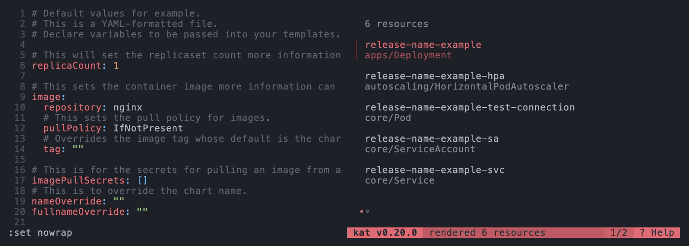

<p align="center">
  <a href="#"></a>
  <h1 align="center">kat</h1>
</p>

<p align="center">
  <code>kat</code> is like <code>cat</code> for projects that render Kubernetes manifests. It provides a pretty terminal UI to quickly <b>find</b>, <b>debug</b>, and <b>reload</b> manifests, without ever leaving your shell.
</p>

<p align="center">
  <code>kat</code> is designed to reduce inner loop time for <b>developers</b> and <b>platform engineers</b> working on things like <code>helm</code> charts and <code>kustomize</code> projects. By defining custom rules in the config, you can make <code>kat</code> work with anything that generates Kubernetes manifests!
</p>

<p align="center">
  <br>
  
</p>

<p align="center">
  ❤️ Made with <a href="https://github.com/charmbracelet/bubbletea">bubble tea</a> and <a href="https://github.com/charmbracelet/glow">glow</a>.
</p>

## ✨ Features

- 🚀 List and filter hundreds of manifests without leaving your shell.
- 🔄 Reload from any context to quickly diff individual manifests.
- 👀 Use `--watch` to trigger reloads on changes to source files.
- 🐛 Immediately view any errors from rendering, and re-reload!
- 🎨 Customize keybinds, styles, and more to match your preferences.
- 🪄 Add your own commands and rules to detect different project types.
- 🚨 Define custom hooks to automatically validate rendered manifests.

## 📦 Installation

### Homebrew

```sh
brew tap macropower/tap
brew install kat --cask
```

### Releases

Archives are posted in [releases](https://github.com/MacroPower/kat/releases).

## ⚡️ Usage

Show help:

```sh
kat --help
```

Render a project in the current directory:

```sh
kat
```

Render a project and enable watch (live reloading):

```sh
kat -w
```

Render a project in a specific directory:

```sh
kat ./example/helm
```

Render a project in a specific directory with command passthrough:

```sh
kat ./example/helm -- helm template my-chart .
```

Render using data from stdin:

```sh
cat ./example/kustomize/resources.yaml | kat -f -
```

## 🌈 Themes


Configure a theme with `--ui-theme`, `KAT_UI_THEME`, or via config:

```yaml
ui:
  theme: "dracula"
```

We use [Chroma](https://github.com/alecthomas/chroma/) for theming, so you can use any styles from the [Chroma Style Gallery](https://xyproto.github.io/splash/docs/).

## ⚙️ Configuration

You can use `kat --write-config` to generate a default configuration file at `~/.config/kat/config.yaml`. This file allows you to customize the behavior of `kat`, such as the UI style, keybindings, and commands.

Alternatively, you can use `kat --show-config` to print the active configuration and redirect the output to a file.

You can also find an example configuration file in [example/config.yaml](example/config.yaml).

### Custom Commands

You can customize the commands that `kat` runs in the configuration file. These rules match files or directories and specify the command to run when `kat` is invoked.

Additionally, you can define hooks:

- `preRender` hooks are executed before the main command is run, allowing you to prepare the environment (e.g., running `helm dependency build`).
- `postRender` hooks are executed after the main command has run, allowing you to process the rendered manifests (e.g., validating them with `kubeconform`).

If any hooks exit with a non-zero status, `kat` will display the error message. You can dismiss the error message and return to the main view, or make edits and press `r` to re-run the command.

```yaml
kube:
  commands:
    # Run `helm template . --generate-name` when kat targets a directory
    # containing a `Chart.yaml` file.
    - match: .*/Chart\.ya?ml$
      source: .*\.(ya?ml|tpl)$ # Used for `--watch`.
      command: helm
      args: [template, ".", --generate-name]
      hooks:
        preRender:
          # Run `helm dependency build` before rendering the chart.
          - command: helm
            args: [dependency, build]
        postRender:
          # Pass the rendered manifests via stdin to `kubeconform`.
          - &kubeconform
            command: kubeconform
            args: [-strict, -summary]

    # Run `kustomize build --enable-helm .` when kat targets a directory
    # containing a `kustomization.yaml` file.
    - match: .*/kustomization\.ya?ml$
      source: .*\.ya?ml$ # Used for `--watch`.
      command: kustomize
      args: [build, --enable-helm, "."]
      hooks:
        postRender:
          - *kubeconform
```

## 🔍️ Similar Tools

- [bat](https://github.com/sharkdp/bat)
- [glow](https://github.com/charmbracelet/glow)
- [k9s](https://github.com/derailed/k9s)
- [viddy](https://github.com/sachaos/viddy)
- [soft-serve](https://github.com/charmbracelet/soft-serve)
- [wishlist](https://github.com/charmbracelet/wishlist)
