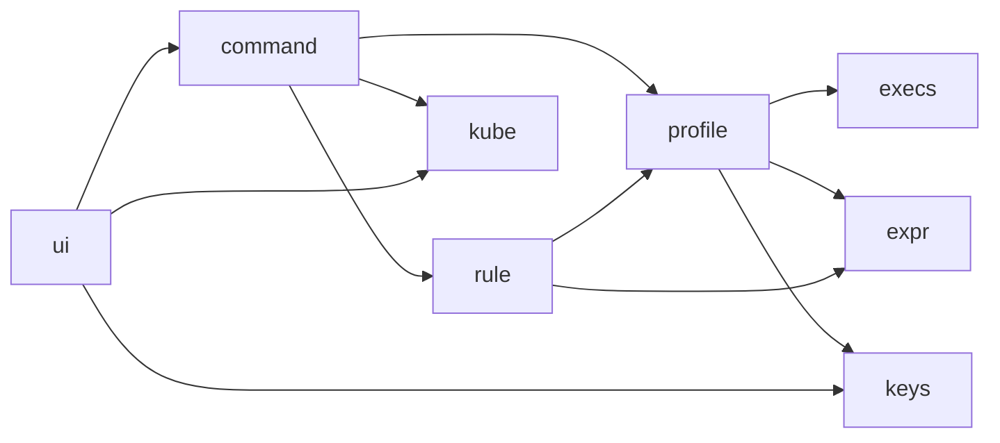

# Packages

## Core Dependency Flow

```mermaid
graph LR
    %% Core packages
    command[command]
    rule[rule]
    profile[profile]
    ui[ui]

    %% Utility packages
    expr[expr]
    keys[keys]
    execs[execs]
    kube[kube]

    %% Dependencies
    command --> kube
    command --> profile
    command --> rule

    profile --> execs
    profile --> expr
    profile --> keys

    rule --> expr
    rule --> profile

    ui --> command
    ui --> kube
    ui --> keys
```
