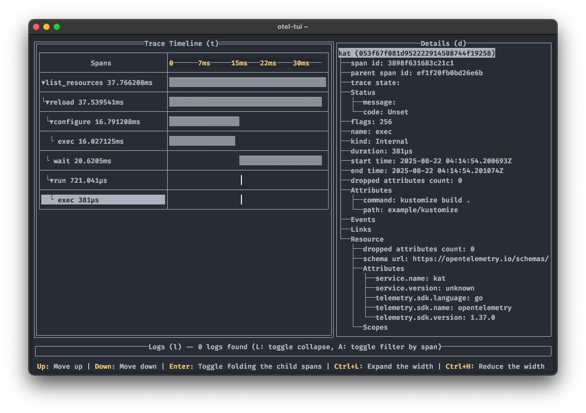

# Troubleshooting

You can use [otel-tui](https://github.com/ymtdzzz/otel-tui) to receive telemetry:

```sh
kat --tracing-endpoint=http://localhost:4317/v1/traces
```



Most of `kat`'s logs are sent with a debug level:

```sh
kat --log-level=debug
```
